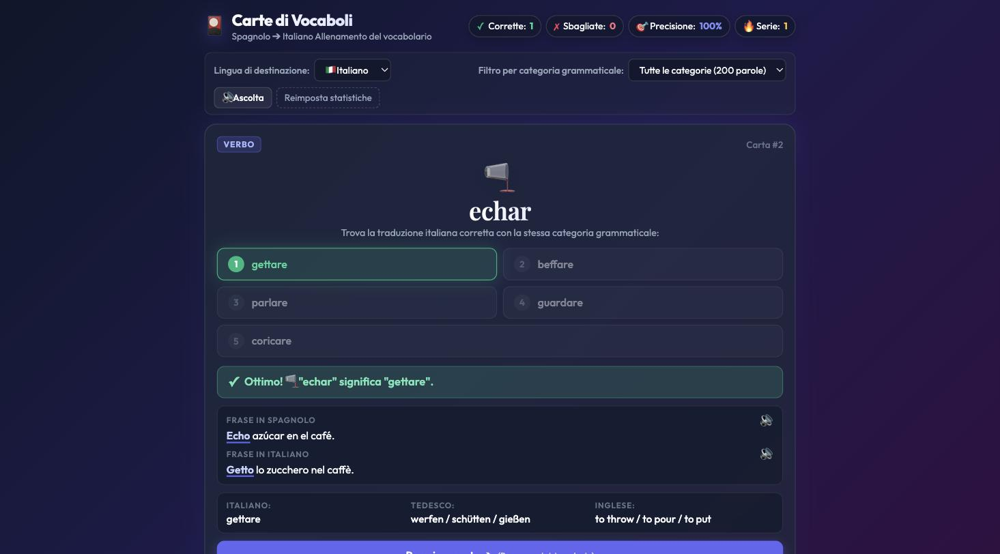

# Carte di Vocaboli / Wortkarten / Word Cards

Un'app a pagina singola per esercitarsi con il vocabolario spagnolo tramite flashcard. HTML/CSS/JS puro — nessuna build, nessuna dipendenza.

Scegli liberamente la lingua di partenza (spagnolo, italiano, tedesco, inglese o francese) e la lingua di destinazione (italiano, tedesco, inglese o francese — sempre diversa dalla lingua di partenza), e il quiz, il feedback, le frasi di esempio e l'intera interfaccia si adattano di conseguenza.



## Funzionalità

- Flashcard a scelta multipla: viene mostrata una parola nella lingua di partenza, bisogna scegliere la traduzione corretta tra 5 opzioni della stessa categoria grammaticale.
- Lingua di partenza (🇪🇸/🇮🇹/🇩🇪/🇬🇧/🇫🇷) e lingua di destinazione (🇮🇹/🇩🇪/🇬🇧/🇫🇷) selezionabili indipendentemente — la lingua di destinazione cambia anche l'intera lingua dell'interfaccia; entrambe le scelte vengono ricordate tra una sessione e l'altra e non possono mai coincidere (selezionandone una uguale all'altra, l'altra viene scambiata automaticamente).
- Dopo la risposta, viene mostrata una frase di esempio nella lingua di partenza e in quella di destinazione, con la parola pertinente sottolineata in entrambe, oltre alle traduzioni di riferimento in italiano, tedesco, inglese e francese.
- Sintesi vocale per la parola di partenza e per entrambe le frasi di esempio, con selezione automatica di una voce di buona qualità per ciascuna lingua; un cursore permette di regolare la velocità della sintesi vocale, e la lingua di partenza viene sempre pronunciata più lentamente per facilitarne l'apprendimento.
- Filtro per categoria grammaticale (sostantivi, verbi, aggettivi, avverbi, o tutte).
- Statistiche (corrette/sbagliate/precisione/serie) e cronologia delle risposte recenti, salvate in locale (`localStorage`).

## Avvio

Servi la cartella via HTTP invece di aprire `index.html` direttamente — alcune API del browser (in particolare la sintesi vocale) si comportano in modo incoerente con `file://`:

```bash
python3 -m http.server 8123
```

Poi apri `http://localhost:8123/index.html`.

## File

- `index.html`, `style.css`, `app.js` — l'applicazione.
- `words_data.js` — il dataset delle prime 200 parole (facili) caricato dall'app.
- `words_data_2.js` — le successive 200 parole più frequenti (difficili), stesso formato.
- `spanish_words_no_italian_cognate_200.csv` — fonte dati grezza originale (solo di riferimento, non caricata a runtime).

Per le note architetturali, vedi `CLAUDE.md`.
